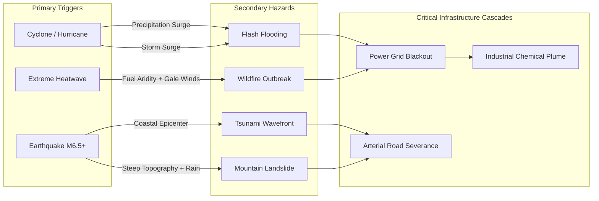

# Deterministic Global Hazard & Intelligence Architecture

## 1. Architectural Philosophy

Climate Eye operates on a **100% deterministic, evidence-grounded intelligence chain**. Every alert, prediction, compound risk, and evacuation corridor displayed on the 3D globe must be mathematically traceable back to observed physical measurements or deterministic physical models.

```text
GLOBAL LIVE DATA + ESP32 (OPTIONAL) + SATELLITE/HAZARD FEEDS
                   ↓
              DATA FUSION
                   ↓
             HAZARD ENGINE
                   ↓
        PREDICTION (+30 / +60 / +360 MIN)
                   ↓
            COMPOUND CASCADE
                   ↓
          HUMAN VULNERABILITY (SVI)
                   ↓
          DYNAMIC EVACUATION ROUTER
                   ↓
           RESPONSE PLANNER & DIRECTIVES
                   ↓
         EXPLAINABILITY / AI COMMAND CENTER
                   ↓
         3D PHOTOREALISTIC CESIUM GLOBE
```

---

## 2. Intelligence Chain Modules

### 2.1. Hazard Engine (`intelligence/hazard/`)

The Hazard Engine ingests normalized spatial features and classifies active danger zones into six discrete taxonomies:
1. **`HEAT`**: Extreme thermal anomaly based on 2-meter air temperature and wet-bulb globe temperature (WBGT).
2. **`WILDFIRE`**: Thermal radiation anomaly clustered from satellite infrared radiometers (VIIRS/MODIS) with Fire Radiative Power (FRP) metrics.
3. **`FLOOD`**: Flash flood or river inundation zones derived from rainfall rate thresholds (>25 mm/h), historical topographic depressions, and GloFAS alerts.
4. **`EARTHQUAKE`**: Dynamic ground motion wavefronts with Richter magnitude scaling and focal depth attenuation.
5. **`CYCLONE`**: Sustained cyclonic wind vortices with forward velocity vectors and barometric central pressure drops.
6. **`AIR_POLLUTION`**: Severe particulate concentrations (PM2.5 / PM10) from edge ground stations or satellite atmospheric sounders.

#### Severity Formulation
$$S = \min\left(1.0, \, w_1 \cdot \frac{M - M_{base}}{M_{max} - M_{base}} + w_2 \cdot C + w_3 \cdot P_{density}\right)$$
Where:
- $M$: Primary physical measurement (e.g., Temperature, FRP, Magnitude, Precipitation).
- $C$: Instrument measurement confidence (0.0 to 1.0).
- $P_{density}$: Normalized human population exposure density.
- $w_1, w_2, w_3$: Normalized weights ($\sum w_i = 1.0$).

---

### 2.2. Prediction Engine: Multi-Horizon Projections

The Prediction Engine computes deterministic forward trajectories across three standardized planning horizons:

```text
+-------------------+-------------------------------------------------------------+
| Horizon           | Operational Focus & Methodology                             |
+-------------------+-------------------------------------------------------------+
| +30 Minutes       | Tactical Nowcasting: Kinematic advection, local wind        |
| (Nowcasting)      | vector propagation, seismic P/S wave arrival times.        |
+-------------------+-------------------------------------------------------------+
| +60 Minutes       | Near-Term Threat Envelope: Thermal plume expansion,         |
| (Tactical)        | micro-basin runoff accumulation, fire perimeter leap.       |
+-------------------+-------------------------------------------------------------+
| +360 Minutes      | Strategic Regional Trajectory: Numerical weather model      |
| (Strategic, 6h)   | advection, cyclonic path cone, synoptic frontal collision.  |
+-------------------+-------------------------------------------------------------+
```

Every prediction record includes:
- `predicted_radius_km`: Expanding spatial footprint.
- `predicted_severity`: Projected severity score with lower and upper confidence bounds.
- `confidence_interval`: Strictly non-increasing as time horizon expands ($\text{Conf}_{360m} \le \text{Conf}_{60m} \le \text{Conf}_{30m}$).

---

### 2.3. Compound Cascade Generator

Disasters rarely occur in isolation. The Compound Cascade Engine models non-linear interactions across concurrent hazards using a directed acyclic hazard dependency graph:



#### Cascade Amplification Multiplier ($A_c$)
When two or more hazards intersect within a spatial threshold ($D \le R_1 + R_2$):
$$A_c = 1.0 + \sum_{i \ne j} \kappa_{ij} \cdot (S_i \cdot S_j)$$
Where $\kappa_{ij}$ is the empirically derived interaction coefficient between hazard types (e.g., $\kappa_{fire, wind} = 0.45$, $\kappa_{rain, earthquake} = 0.35$).

---

### 2.4. Human Vulnerability & SVI Integration

The platform cross-references active hazard perimeters with geospatial human population density and the CDC/WHO Social Vulnerability Index (SVI).

Vulnerability Score ($V$) is calculated across 4 core themes:
1. **Socioeconomic Status**: Below poverty threshold, unemployed, housing cost burden.
2. **Household Composition**: Age 65 and older, age 17 and younger, persons with disabilities.
3. **Race / Ethnicity / Language**: Minority communities, English proficiency barriers.
4. **Housing Type & Transportation**: Multi-unit housing, mobile homes, zero-vehicle households.

$$V_{total} = \alpha \cdot \text{SVI}_{regional} + \beta \cdot \frac{\text{Pop}_{exposed}}{\text{Area}_{km^2}} + \gamma \cdot \text{Infra}_{critical}$$

---

### 2.5. Dynamic Evacuation Routing

The Evacuation Routing Engine calculates optimal egress paths for civilian populations caught within hazard perimeters:
- **Impassable Zone Generation**: Hazard polygons buffered by a 1.5× safety margin are marked as closed obstacles.
- **Route Optimization**: Uses topological network graph algorithms (A* with dynamic edge weights penalizing proximity to expanding hazards).
- **Muster Point Allocation**: Routes populations to safe shelters, elevated muster zones (for floods), or air-filtered municipal centers (for wildfire smoke).

---

### 2.6. AI Command Center (`ACTIVE — DETERMINISTIC EVIDENCE MODE`)

The AI Command Center operates strictly in **Deterministic Evidence Mode**:
- **Zero Hallucination Guarantee**: The model is prohibited from synthesizing speculative numbers, imaginary sensor nodes, or unverified disaster events.
- **Evidence-Based Prompts**: Prompts contain only structured JSON schemas produced by the upstream deterministic engines:
  - Top 5 critical hazard zones.
  - Active compound cascades.
  - Population exposure counts.
  - Recommended emergency directives.
- **Auditable Response Directives**: Generates prioritized tactical orders (e.g., `DIRECTIVE 1: EVACUATE SECTOR 4`, `DIRECTIVE 2: DEPLOY COOLING BUSES`).

---

### 2.7. Photorealistic 3D Cesium Client Implementation

The frontend geospatial visualization executes within CesiumJS 1.124:
- **`CustomDataSource` Hierarchy**:
  - Hazard zones are rendered as glowing semi-transparent volumetric ellipsoids or tessellated corridor extrusions.
  - Color palettes use standard tactical threat colors:
    - Heat: `#ff6b35` (Thermal Orange)
    - Fire: `#ff2a2a` (Combustion Crimson)
    - Flood: `#00b4d8` (Hydraulic Cyan)
    - Earthquake: `#ffd166` (Seismic Gold)
    - Compound: `#9d4edd` (Compound Violet)
- **Interactive Tactical HUD Popover**:
  - Clicking any entity on the globe projects a tactical HUD popover pinned in screen coordinates.
  - Shows severity bar, confidence percentage, epistemic status badge, source attribution, UTC timestamp, exposed population, and actionable directives.
